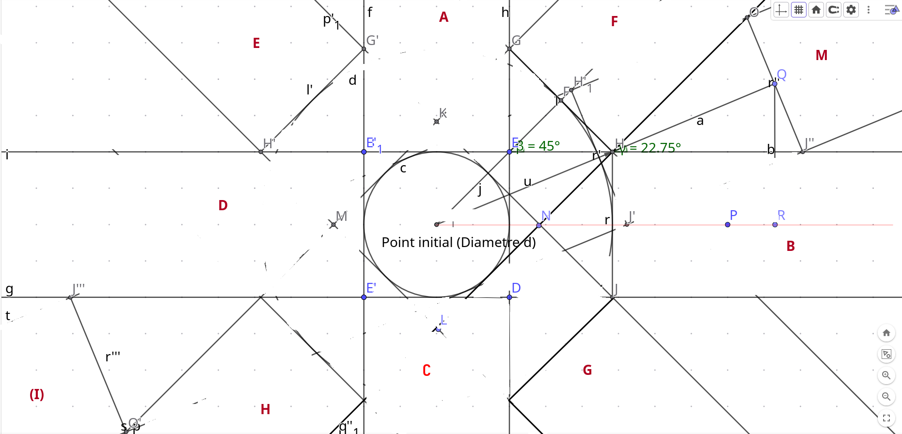

# Polar Grid  

## Polar lines  

### Limit  

First Draw lines are A B C and D  
The second (and so on) lines must be  
Cleated to avoid an overlaying
E F G H lines must be offset
of a distance  
l = AF,
Depending of an angle
Beta = pi / 4

(I) (J) (K) (L) M (N) (O) and (P)
Are not represented (but M)
And should have an offset of
l = AQ
